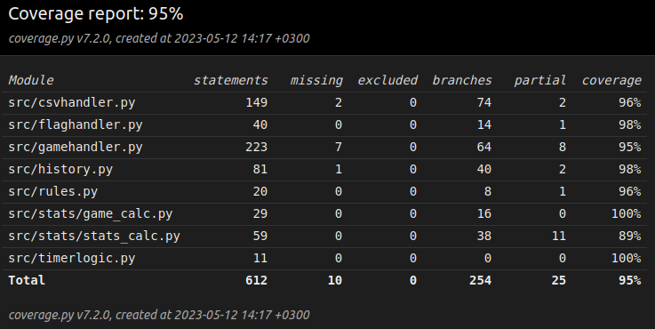

# Software Testing

Basic software logic has been rigorously tested with automated testing and wider software functionality, including e.g. software installation and graphical user interface performance, has been manually checked.

As the core game logic deals simultaneously with some GUI elements, the `MagicMock` library from `unittest.mock` is utilized to simulate e.g. the [`Stats`](../src/gui_elements/gui_stats.py "GUI Stats source code") class from the graphical user interface. Similarly the `exit()` calls within the game source code are ignored with the help of `builtins` and `patch` libraries.

## Automated Test Modules

All automated test modules are located [here](../src/tests/ "Tests folder"). Short descriptions of the test modules are provided down below:

### GAMEHANDLER_TEST

The [GameHandler](../src/tests/a_gamehandler_test.py "GameHandler Test source code") test module performs a wide range of tests assessing the core game logic. These tests include, for example, the launching of game modes, cancelling a game, and rewarding the player with a correct amount of points. It also checks e.g. if Time Trial games are cancelled after a 5 second round time.

### FLAGHANDLER_TEST

The [FlagHandler](../src/tests/b_flaghandler_test.py "FlagHandler Test source code") test module performs some tests assessing the logic responsible for the flag image importing. These tests include, for example, what happens if flags cannot be imported, or if the [reference document](../src/logs/correctflags.txt "List of correct flags") listing the correct files is missing.

### TIMERLOGIC_TEST

The [TimerLogic](../src/tests/c_timerlogic_test.py "TimerLogic Test source code") test module performs a couple of tests assessing the timer logic. These tests include, for example, how the timer returns different decimal place values.

### HISTORY_TEST

The [History](../src/tests/d_history_test.py "History Test source code") test module performs multiple tests assessing the logic responsible for game history managing. These tests include, for example, how the software creates new files if old ones cannot be found, or what text is written to file when a game is terminated. It also checks that e.g. the history is correctly erased when requested.

### CSVHANDLER_TEST

The [CSVHandler](../src/tests/e_csvhandler_test.py "CSVHandler Test source code") test module performs a lot of tests assessing the logic responsible for game statistics recording. These tests include, for example, how the data files are written and handled, how the software calculates the player lifelong statistics, and whether it avoids all zero division errors. It also checks that e.g. the statistics are correctly erased when requested.

### RULES_TEST

The [Rules](../src/tests/f_rules_test.py "Rules Test source code") test module performs a few tests assessing the logic reading the [rulebook](../src/logs/gamerules.txt "Open the Rule Book"). These tests include, for example, how the software acts if no rule book can be found, or if the rule book row count is not the expected (70).

## Test Coverage

The automated unit tests cover around 95% of the software source code excluding all [graphical user interface modules](../src/gui_elements/ "GUI folder") along with `gui.py`. It also ignores the `main.py` module.

## Software Build & Graphical User Interface

Software installation and graphical user interface functionality has been checked manually.

### GRAPHICAL USER INTERFACE

The overall functionality and appearance of the graphical user interface has been manually checked and verified to be working as intended. Every game mode has been tested with multiple different inputs to ensure all error handling is working properly. All core functionality from [Software Requirements Specification](requirements_specification.md "Software Requirements Specification") has been tested.

## Remaining Quality Concerns

Software does not handle well situations where it lacks the proper read/write permissions to e.g. flag source directories or existing player statistics files.

History doesn't pick up the change of date during software execution (e.g. software launched at 23:57 and session lasts for more than 3 minutes). This could be addressed better to get a more accurate history logbook.

For more information regarding source code quality, see [remaining issues with source code quality](./architecture.md#remaining-issues-with-source-code-quality--software-logic "Read more about Remaning Quality Concerns").
