# USER MANUAL

Complete user manual for software usage. Updated April 14th 2024 (ver 0.2.7). Latest release of the software source code can be found [here](https://github.com/joonarafael/ohte/releases "Flag Game Releases").

## Installation

This manual will guide you through the installation procedure for Linux systems. Users of other operating systems may need to perform some creative problem solving to get the software up and running. Generally speaking, Python 3.10 and relevant dependencies (_Tkinter_ and _Pillow_) should do the job.

1. Clone this Github repository to your local machine by executing:

```bash
git clone https://github.com/joonarafael/ohte.git
```

You may also get the source code as a ZIP folder from the [releases page](https://github.com/joonarafael/flaggame/releases "Flag Game Releases").

2. After entering the directory with `cd flaggame`, give execution rights to the dependency installation script with

```bash
chmod u+x ./setup.sh
```

3. Resolve dependencies by executing:

```bash
./setup.sh
```

4. Run the game by executing:

```bash
./run.sh
```

## Controls

**Everything is controlled with the mouse cursor**. No keyboard input required at all.

## Graphical User Interface & Software Navigation

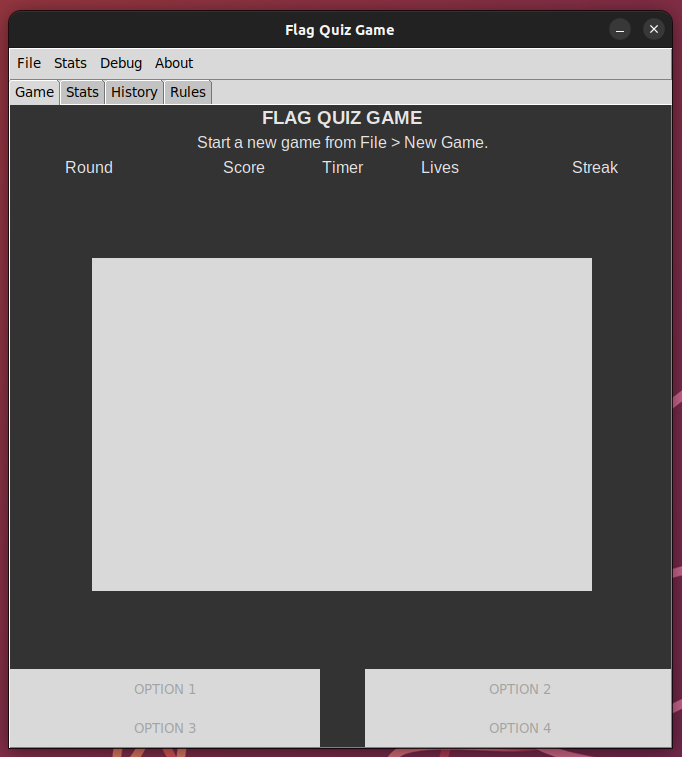

The game window is split into **4 different tabs**:

### Game

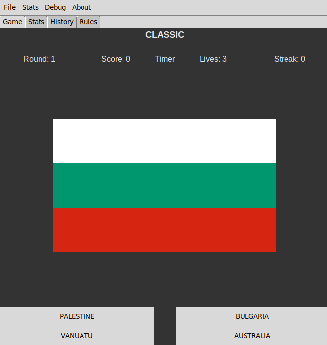

**Game tab includes the main game**. Current _game mode_ (or e.g. a cancelled game), _answer feedback_ (whether user's answer was right/wrong), and the _game status bar_ (_current round_, _score_, etc.) are displayed at the top of the tab. _Viewport_ beneath shows the _current flag_. Player answer is communicated with the 4 _buttons_ located at the bottom of the tab. During _[Free Flag Browsing](./user_manual.md#free-flag-browsing "Read more about Free Flag Browsing")_ player can shuffle through the flags with these 4 buttons.

### Stats

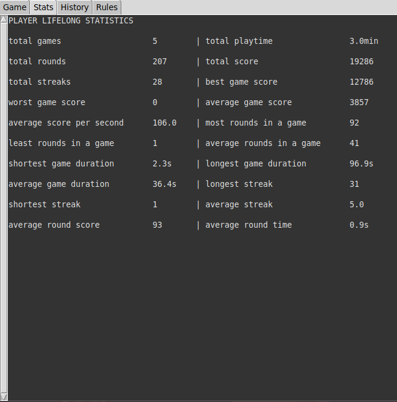

**Stats tab contains the Player Lifelong Statistics** and by switching the view from the [Stats menu](./user_manual.md#switch-game-browse-view "Read more about different history views"), it shows the complete record of all games played. _Every system/machine has its own local database containing the statistics_. They're not synced through Github. **To ensure proper functionality of the statistics system, please do not manually modify/move/remove any of the data files within** `./flaggame/src/logs`. This applies to history recording as well. Software might run into errors if these files are modified externally by the user. Statistics and history can be erased from within the software. See [Clear history](./user_manual.md#clear-history "Learn how to clear game history").

### History

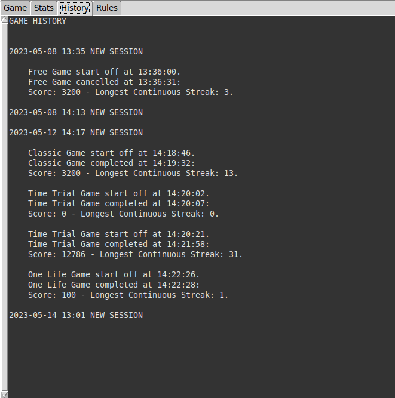

**Complete software usage history is displayed in the history tab**. In addition to all game events, it's also possible to view the software launch times from this tab. _Every system/machine has its own local history_. It's not synced through Github.

### Rules

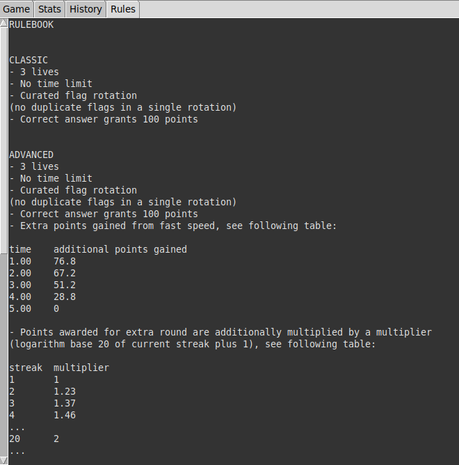

**The [game rulebook](../flaggame/src/logs/gamerules.txt) is constantly displayed in the Rules tab**. It includes detailed information about every game mode.

## MENUS

### FILE

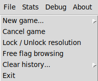

#### **New Game...**

Start a new game by selecting the game mode. Game modes include _Classic_, _Advanced_, _Time Trial_, _One Life_, and _Free Mode_ (See [rule book](../flaggame/src/logs/gamerules.txt "Open Rule Book") for details). Every game start is recorded to history. Game will be recorded and calculated into statistics if more than one round is played (excluding Time Trial, which is recorded anyways).

#### **Cancel Game**

Cancel any ongoing game. If an ongoing game is terminated, the current game state will be recorded to history & statistics. The "_Master GameHandler_" instance (responsible for all core game logic) receives **a complete reset** when a game is cancelled (good for debugging purposes if game logic gets stuck).

#### **Lock / Unlock Resolution**

Lock or unlock the master game window resolution. Locked window dimensions are printed to console. Default window resolution is 663x668.

#### **Free Flag Browsing**

Browse all 198 flags freely. **Any ongoing game will be terminated** (see [Cancel game](./user_manual.md#cancel-game "Learn how to cancel a game")).

#### **Clear History...**

Option to clear the recorded history. Additionally all recorded statistics can be erased. **All saved progress will be lost**, software will exit.

#### **Exit**

Exit software. **Any ongoing game will be terminated** (see [Cancel Game](./user_manual.md#cancel-game "Read more about game termination")).

### STATS

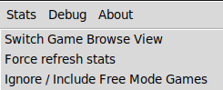

#### **Switch Game Browse View**

Toggle the view between "_Player Lifelong Statistics_" and "_All Recorded Games_".

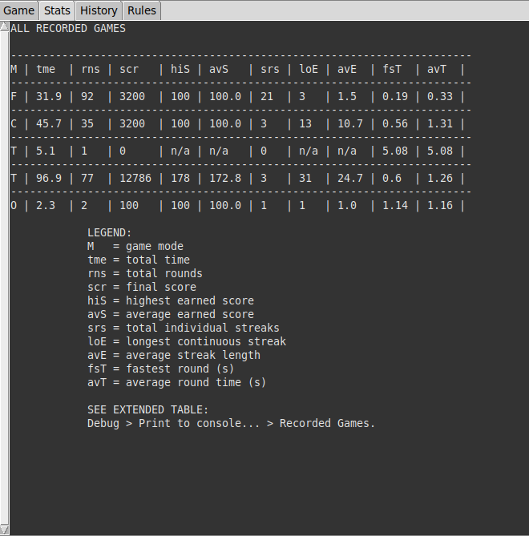

#### **Force Refresh Stats**

Option to force the _statistic refresh sequence_ (mainly for debugging purposes).

#### **Ignore / Include Free Mode Games**

Select whether to include the Free Mode games in the statistics calculations or not. **Current preference is indicated in the title of the content (first row)**:

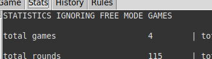

### DEBUG

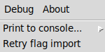

#### **Print to Console...**

Wide selection of different software _file paths_, _critical directories_ and _statistics files_ to get printed out to console for debugging purposes.

#### **Retry Flag Import...**

**Flag import sequence can be retried** still after software start. Games can't be launched if the total amount of flags found is not equal to 198.

### ABOUT

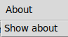

#### **Show About**

Show the software 'About' screen.
